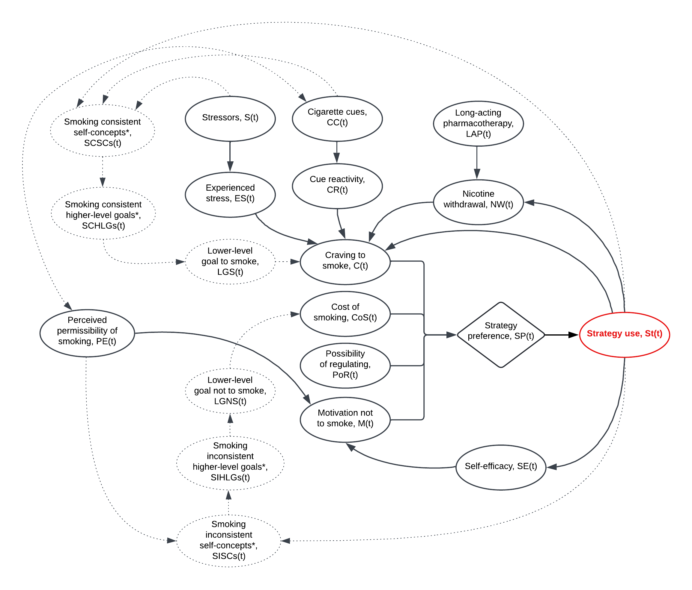

```{r setup, include=FALSE}

knitr::opts_chunk$set(echo = TRUE, collapse = TRUE)

```

```{r}

library(here)
library(tidyverse)
library(ggplot2)
library(cowplot)

```



# Variables and equations

## List of variables

- *\(LAP\)* = Long-acting pharmacotherapy
- *\(NW\)* = Nicotine withdrawal
- *\(S\)* = Stressors
- *\(ES\)* = Experienced stress
- *\(CC\)* = Cigarette cues
- *\(CR\)* = Cue reactivity
- *\(C\)* = Craving to smoke
- *\(PE\)* = Perceived permissibility of smoking
- *\(SE\)* = Self-efficacy
- *\(M\)* = Motivation not to smoke
- *\(SP\)* = Strategy preference
- *\(P\)* = Probability of strategy use
- *\(St\)* = Strategy use

## List of equations

For ease of use, the free parameters are labelled according to the Greek alphabet.

1) Long-acting pharmacotherapy: \(LAP(t) = \begin{cases}
1 \times \alpha & \text{if } t = \text{first hour of the day } \\
0 & \text{otherwise}
\end{cases}\)
2) Nicotine withdrawal: \(NW(t) = \beta_1 NW(t-1) - LAP(t) - \beta_2 St_{smok}(t) + \beta_3 St_{smok}(t-36)\)
3) Stressors: \(S(t) \sim \text{Bernoulli}(\gamma_1)\)
4) Experienced stress: \(ES(t) = \delta_1 ES(t-1) + \delta_2 S(t)\)
5) Cigarette cues: \(CC(t) \sim \text{Bernoulli}(\epsilon_1)\)
6) Cue reactivity: \(CR(t) = \zeta_1 CR(t-1) + CC(t)\)
7) Craving to smoke: \(C(t) = \eta_1 NW(t) + \eta_2 ES(t) + \eta_3 CR(t) - \eta_4 St_{reg}(t-1)\)
8) Perceived permissibility of smoking: \(PE(t) \sim \text{Bernoulli}(\theta_1)\)
9) Self-efficacy: \(SE(t) = \iota_1 SE(t-1) - \iota_2 St_{smok}(t-1)\)
10) Motivation not to smoke: \(M(t) = \kappa_1 SE(t) - \kappa_2 PE(t)\)
11) Strategy preference: \(SP(t) = \begin{bmatrix}
\text{Pref}_{smok} = \lambda_1 C(t) - \lambda_2 M(t) - \lambda_3 CoS(t) \\
\text{Pref}_{no-smok} = \lambda_2 M(t) - \lambda_1 C(t) \\
\text{Pref}_{reg} = \lambda_2 M(t) - \lambda_1 C(t) - \lambda_4 PoR \\
\end{bmatrix} \\\)
12) Probability of strategy use: \(z_1 = \text{Pref}_{\text{smok}} \\ 
z_2 = \text{Pref}_{\text{no-smok}} \\ 
z_3 = \text{Pref}_{\text{reg}} \\
P(t) = \begin{bmatrix}
\text{Prob}_{\text{smok}} = \frac{e^{z_1}}{e^{z_1} + e^{z_2} + e^{z_3}} \\
\text{Prob}_{\text{no-smok}} = \frac{e^{z_2}}{e^{z_1} + e^{z_2} + e^{z_3}} \\
\text{Prob}_{\text{reg}} = \frac{e^{z_3}}{e^{z_1} + e^{z_2} + e^{z_3}} \\
\end{bmatrix}\)
13) Strategy use: \(St(t) = \begin{cases}
1 & \text{with probability } \text{Prob}_{\text{smok}} \\
2 & \text{with probability } \text{Prob}_{\text{no-smok}} \\
3 & \text{with probability } \text{Prob}_{\text{reg}}
\end{cases}\)

# Progressively build up the functions and simulate data for each before adding the functions together

## 1) Long-acting pharmacotherapy

Assumptions about variable:

- Represented as an impulse function, which has its impact the first time tick of the day (assuming that a new patch is applied every 16-24 hours)
- Long-acting pharmacotherapy (e.g., transdermal nicotine patches) attenuates background, but not cue-driven, cravings

We formalise long-acting pharmacotherapy as:

$$
LAP(t) = \begin{cases}
1 \times \alpha & \text{if } t = \text{first tick of the day } \\
0 & \text{otherwise}
\end{cases}
$$

where $\alpha$ is a constant which modifies the impact of using long-acting pharmacotherapy on the nicotine withdrawal.

```{r}

### long-acting pharmacotherapy

fun_LAP <- function(impulse, alpha) {
  
  if (impulse == 1) {
    
    return(1 * alpha)
    
  } else {
    
    return(0)
    
  }
  
}

nTime <- 2880
LAP <- numeric(nTime)
impulse <- numeric(nTime)
alpha <- 0.5

for (t in 1:nTime) {
  
  impulse[t] <- ifelse((t - 1) %% 288 == 0, 1, 0) # checks whether nTime - 1 is divisible by 288, which will be true for the first time tick each day
  LAP[t] <- fun_LAP(impulse = impulse[t], alpha = alpha)
  
}  

LAP_df <- data.frame(nTime = 1:nTime, impulse, LAP)

ggplot(LAP_df, aes(x = nTime)) +
  geom_line(aes(y = LAP), linewidth = 0.75) +
  labs(x = "Time (in 5-minute ticks)",
       y = "Impulse effect of long-acting pharmacotherapy") +
  theme_minimal(base_size = 9) +
  scale_y_continuous(labels = scales::number_format(accuracy = 0.01))

```

## 2) Nicotine withdrawal

Assumptions about variable:

- Can take values from 0 to 10
- Without any lapses, the nicotine withdrawal declines linearly to pre-cessation levels over a period of six months
- Is mitigated by the use of long-acting pharmacotherapy
- A lapse immediately reduces the nicotine withdrawal but increases it in the next few ticks

We formalise background craving as:

$$
NW(t) = \beta_1 NW(t-1) - LAP(t) - \beta_2 St_{smok}(t) + \beta_3 St_{smok}(t-36)
$$

where $\beta_1$ is a decay parameter, $\beta_2$ represents the short-term impact of a lapse on the nicotine withdrawal, $\beta_3$ represents the longer-term impact of a lapse on the nicotine withdrawal and $\beta_4$ represents the time lag for the longer-term impact.

```{r}

### nicotine withdrawal

fun_NW <- function(beta1, NW, LAP, beta2, St, beta3, switch_t) {
  
  if (t == 1) {
    
    NW <- NW_init
    
    if (switch_t == 1) {
      
      return((beta1 * NW) - LAP - (beta2 * St[t, 1]) + (beta3 * St[t-36, 1]))
      
    } else {
      
      return((beta1 * NW) - LAP - (beta2 * St[t, 1]))
      
    } 
    
  } else {
    
    NW <- NW
    
    if (switch_t == 1) {
      
      return((beta1 * NW) - LAP - (beta2 * St[t, 1]) + (beta3 * St[t-36, 1]))
      
    } else {
      
      return((beta1 * NW) - LAP - (beta2 * St[t, 1]))
      
    }
    
  }
  
}

NW <- numeric(nTime)
NW_init <- 8
NW[1] <- NW_init
St <- matrix(0, nrow = nTime, ncol = 3)
for(i in 2:nTime){
  random_col <- sample(3, 1) 
  St[i, random_col] <- 1
}
beta1 <- 0.997
beta2 <- 0.02
beta3 <- 0.1
switch_t <- numeric(nTime)

for (t in 1:nTime) {
  
  switch_t[t] <- if_else(t >= 288, 1, 0)
  
  NW[t] <- fun_NW(beta1 = beta1, NW = NW[t-1], LAP = LAP[t], beta2 = beta2, St = St, beta3 = beta3, switch_t = switch_t[t])
  
  if (NW[t] < 0) {
    NW[t] <- 0
  }
  
  if (NW[t] > 10) {
    NW[t] <- 10
  }
  
}  

NW_df <- data.frame(nTime = 1:nTime, switch_t, LAP, NW, St_smok = St[, 1])

ggplot(NW_df, aes(x = nTime)) +
  geom_line(aes(y = NW), linewidth = 0.75) +
  geom_point(aes(y = St_smok), color = "red", shape = 6) +
  labs(x = "Time (in 5-minute ticks)",
       y = "Nicotine withdrawal") +
  theme_minimal()

```

## 3) Stressors

Assumptions about variable:

Assumptions about variable:

- Conceptualised as exposure to highly, rather than moderately, stressful events
- Can take values of 0 or 1 (binary variable)
- Generally rare, with people expected to be exposed to, on average, a handful of stressors per day

We formalise stressful event as:

$$
S(t) \sim \text{Bernoulli}(\gamma_1)
$$

where $\gamma_1$ is the probability of being exposed to a stressor.

```{r}

### stressors

fun_S <- function(gamma1) {
  
  S <- rbinom(1, 1, gamma1)
  
}

S <- numeric(nTime)
gamma1 <- 0.005

for (t in 1:nTime) {
  
  S[t] <- fun_S(gamma1 = gamma1)
  
} 

S_df <- data.frame(nTime = 1:nTime, S)

ggplot(S_df, aes(x = nTime)) +
  geom_point(aes(y = S), size = 0.8, shape = 3) +
  labs(x = "Time (in 5-minute ticks)",
       y = "Stressful event") +
  theme_minimal()

```

## 4) Experienced stress

Assumptions about variable:

- Can take values between 0 and 10
- The influence of a stressor on the experienced stress decays over time
- If a new stressful event occurs shortly after the first one, it adds to the experienced stress

We formalise experienced stress as:

$$
ES(t) = \delta_1 ES(t-1) + \delta_2 S(t)
$$

where $\delta_1$ is a decay parameter and $\delta_2$ represents the impact of a recent stressful event.

```{r}

### experienced stress

fun_ES <- function(delta1, ES, delta2, S) {
  
  if (t == 1) {
    
    ES <- ES_init
    
    return((delta1 * ES) + (delta2 * S))
    
  } else {
    
    ES <- ES
    
    return((delta1 * ES) + (delta2 * S))
    
  }
  
}

ES <- numeric(nTime)
ES_init <- 3
ES[1] <- ES_init
S <- S # generated in above function
delta1 <- 0.98
delta2 <- 4

for (t in 1:nTime) {
  
  ES[t] <- fun_ES(delta1 = delta1, ES = ES[t-1], delta2 = delta2, S = S[t])
  
  if (ES[t] < 0) {
    ES[t] <- 0
  }
  
  if (ES[t] > 10) {
    ES[t] <- 10
  }
  
} 

ES_df <- data.frame(nTime = 1:nTime, S, ES)

ggplot(ES_df, aes(x = nTime)) +
  geom_line(aes(y = ES), linewidth = 0.7) +
  geom_point(aes(y = S), colour = "red", shape = 2, size = 1.5, stroke = 1) +
  labs(x = "Time (in 5-minute ticks)",
       y = "Experienced stress") +
  theme_minimal()

```

## 5) Cigarette cues

Assumptions about variable:

- Can take values of 0 or 1 (binary variable)
- Generally frequently encountered, with people expected to be exposed to several cigarette cues per day

We formalise cigarette cue as:

$$
CC(t) \sim \text{Bernoulli}(\epsilon_1)
$$

where $\epsilon_1$ is the probability of encountering a cigarette cue (e.g., an ashtray, an advert, a lit up cigarette, a tobacco outlet, alcohol, coffee).

```{r}

### cigarette cues

fun_CC <- function(epsilon1) {
  
  CC <- rbinom(1, 1, epsilon1)
  
}

CC <- numeric(nTime)
epsilon1 <- 0.02

for (t in 1:nTime) {
  
  CC[t] <- fun_CC(epsilon1 = epsilon1)
  
}

CC_df <- data.frame(nTime = 1:nTime, CC)

ggplot(CC_df, aes(x = nTime)) +
  geom_point(aes(y = CC), shape = 8, stroke = 1) +
  labs(x = "Time (in 5-minute ticks)",
       y = "Cigarette cues") +
  theme_minimal()

```

## 6) Cue reactivity

Assumptions about variable:

- Can take values between 0 and 10
- The influence of a cigarette cue decays over time
- If another cue is encountered shortly after the first one, it adds to the previous cue

We formalise cue reactivity as:

$$
CR(t) = \zeta_1 CR(t-1) + \zeta_2 CC(t)
$$

where $\zeta_1$ is a decay parameter and $\zeta_2$ represents the impact of a recent cigarette cue.

```{r}

### cue reactivity

fun_CR <- function(zeta1, CR, zeta2, CC) {
  
  if (t == 1) {
    
    CR <- CR_init
    
    return((zeta1 * CR) + (zeta2 * CC))
    
  } else {
    
    CR <- CR
    
    return((zeta1 * CR) + (zeta2 * CC))
    
  }
  
}

CR <- numeric(nTime)
CR_init <- 3
CR[1] <- CR_init
CC <- CC # generated in above function
zeta1 <- 0.95
zeta2 <- 4

for (t in 1:nTime) {
  
  CR[t] <- fun_CR(zeta1 = zeta1, CR = CR[t-1], zeta2 = zeta2, CC = CC[t])
  
  if (CR[t] < 0) {
    CR[t] <- 0
  }
  
  if (CR[t] > 10) {
    CR[t] <- 10
  }
  
}

CR_df <- data.frame(nTime = 1:nTime, CC, CR)

ggplot(CR_df, aes(x = nTime)) +
  geom_line(aes(y = CR), colour = "black") +
  geom_point(aes(y = CC), colour = "red", shape = 21, stroke = 1) +
  labs(x = "Time (in 5-minute ticks)",
       y = "Cue reactivity") +
  theme_minimal()

```

## 7) Craving to smoke

Assumptions about variable:

- Conceptualised as the subjective experience of wanting to smoke, which is caused by the nicotine withdrawal, stressors and cigarette cues
- Can take values between 0 and 10
- Although the nicotine withdrawal declines over time, as stressors and cigarette cues fluctuate over the course of the day, the craving to smoke can also fluctuate dramatically over the course of the day
- If a regulatory strategy is used at the previous time tick, this reduces the craving to smoke; the magnitude of the reduction is expected to depend on whether it's a pharmacological or non-pharmacological strategy

We formalise the craving to smoke as:

$$
C(t) = \eta_1 NW(t) + \eta_2 ES(t) + \eta_3 CR(t) - \eta_4 St_{reg}(t-1)
$$

where $\eta_1$, $\eta_2$, and $\eta_3$ are weight parameters which determine the strength of influence of the nicotine withdrawal, the experienced stress, and the cue reactivity, respectively, on the craving to smoke, and $\eta_4$ and $\eta_5$ represent the impact of having recently used a non-pharmacological or a pharmacological regulatory strategy, respectively, on the craving to smoke.

```{r}

### craving to smoke

fun_C <- function(eta1, NW, eta2, ES, eta3, CR, eta4, eta5, St, str_scenario) {
  
  if (t == 1) {
    
    St <- 0
    
    if (str_scenario == 0) { # set to zero if the person doesn't have access to short-acting pharmacotherapy
      
      return((eta1 * NW) + (eta2 * ES) + (eta3 * CR) - (eta4 * St))
      
    } else {
      
      return((eta1 * NW) + (eta2 * ES) + (eta3 * CR) - (eta5 * St))
      
    } 
    
  } else {
    
    St <- St
    
    if (str_scenario == 0) {
      
      return((eta1 * NW) + (eta2 * ES) + (eta3 * CR) - (eta4 * St))
      
    } else {
      
      return((eta1 * NW) + (eta2 * ES) + (eta3 * CR) - (eta5 * St))
      
    }
    
  }
  
}

C <- numeric(nTime)
NW <- NW # generated in above function
ES <- ES # generated in above function
CR <- CR # generated in above function
St <- St # generated in above function
eta1 <- 0.4
eta2 <- 0.3
eta3 <- 0.3
eta4 <- 0.1
eta5 <- 0.3
str_scenario <- 0

for (t in 1:nTime) {
  
  C[t] <- fun_C(eta1 = eta1, NW = NW[t], eta2 = eta2, ES = ES[t], eta3 = eta3, CR = CR[t], eta4 = eta4, eta5 = eta5, St = St[t-1, 3], str_scenario = str_scenario)
  
}

C_df <- data.frame(nTime = 1:nTime, C, NW, ES, CR, St)

ggplot(C_df, aes(x = nTime)) +
  geom_line(aes(y = C), colour = "black", size = 0.75) +
  geom_line(aes(y = NW), colour = "grey") +
  geom_line(aes(y = ES), colour = "blue") +
  geom_line(aes(y = CR), colour = "red") +
  labs(x = "Time (in 5-minute ticks)",
       y = "Craving to smoke") +
  theme_minimal()

```

## 8) Perceived permissibility of smoking

Assumptions about variable:

- Categorical variable with four response options, dichotomised for ease of interpretation into: 0) forbidden/discouraged; 1) allowed/encouraged
- The perceived permissibility of smoking is assumed to be correlated with the presence of cigarette cues

We formalise the permissibility of smoking as:

$$
PE(t) \sim \text{Bernoulli}(\theta_1)
$$

where $\theta_1$ is the probability of being in a physical or social context in which smoking is perceived as permissible.

```{r}

### perceived permissibility of smoking

fun_PE <- function(theta1) {
  
  PE <- rbinom(1, 1, theta1) 
  
  transformed_PE <- ifelse(PE == 0, -1, PE) # recode such that cigarettes being forbidden/discouraged is represented by negative values
  
}

PE <- numeric(nTime)
transformed_PE <- numeric(nTime)
theta1 <- 0.5

for (t in 1:nTime) {
  
  transformed_PE[t] <- fun_PE(theta1 = theta1)
  
} 

PE_df <- data.frame(nTime = 1:nTime, transformed_PE)

ggplot(PE_df, aes(x = nTime)) +
  geom_point(aes(y = transformed_PE), colour = "black", shape = 17, stroke = 1) +
  labs(x = "Time (in 5-minute ticks)",
       y = "Perceived permissibility of smoking") +
  theme_minimal()

```

## 9) Self-efficacy

Assumptions about variable:

- Can take values from 0 to 10
- Without any lapses, self-efficacy gradually increases over time due to feelings of mastery
- Self-efficacy is negatively impacted by lapses

We formalise self-efficacy as:

$$
SE(t) = \iota_1 SE(t-1) - \iota_2 St_{smok}(t-1)
$$

where $\iota_1$ is a growth parameter and $\iota_2$ represents the impact of a recent lapse ($St_{smok}$) on the self-efficacy.

```{r}

### self-efficacy

fun_SE <- function(iota1, SE, iota2, St) {
  
  if (t == 1) {
    
    SE <- SE_init
    
    St <- 0
    
    return((iota1 * SE) - (iota2 * St))
    
  } else {
    
    SE <- SE
    
    return((iota1 * SE) - (iota2 * St[t-1, 1]))
    
  }
  
}

SE <- numeric(nTime)
SE_init <- 6
SE[1] <- SE_init
iota1 <- 1.0015
iota2 <- 0.1

for (t in 1:nTime) {
  
  SE[t] <- fun_SE(iota1 = iota1, SE = SE[t-1], iota2 = iota2, St = St)
  
  if (SE[t] < 0) {
    SE[t] <- 0
  }
  
  if (SE[t] > 10) {
    SE[t] <- 10
  }
  
} 

SE_df <- data.frame(nTime = 1:nTime, SE, St_smok = St[, 1])

ggplot(SE_df, aes(x = nTime)) +
  geom_line(aes(y = SE), colour = "black") +
  geom_point(aes(y = St_smok), colour = "red", shape = 2, stroke = 1) +
  labs(x = "Time (in 5-minute ticks)",
       y = "Self-efficacy") +
  theme_minimal()

```

## 10) Motivation not to smoke

Assumptions about variable:

- Can take values from 0 to 10
- Temporarily impacted by the self-efficacy and contextual factors through the perceived permissibility of smoking (i.e., if it is perceived to be permissible to smoke, motivation declines; if it is perceived to be discouraged or forbidden, motivation increases)

We formalise motivation as:

$$
M(t) = \kappa_1 SE(t) - \kappa_2 PE(t)
$$

where $\kappa_1$ represents the impact of self-efficacy and $\kappa_2$ represents the impact of the perceived permissibility of smoking on the motivation not to smoke.

```{r}

### motivation not to smoke

fun_M <- function(kappa1, SE, kappa2, transformed_PE) {
  
  return((kappa1 * SE) - (kappa2 * transformed_PE))
  
}

M <- numeric(nTime)
SE <- SE # generated in above function
transformed_PE <- transformed_PE # generated in above function
kappa1 <- 0.9
kappa2 <- 1.2

for (t in 1:nTime) {
  
  M[t] <- fun_M(kappa1 = kappa1, SE = SE[t], kappa2 = kappa2, transformed_PE = transformed_PE[t])
  
  if (M[t] < 0) {
    M[t] <- 0
  }
  
  if (M[t] > 10) {
    M[t] <- 10
  }
  
} 

M_df <- data.frame(nTime = 1:nTime, M, SE, transformed_PE)

ggplot(M_df, aes(x = nTime)) +
  geom_line(aes(y = M), colour = "black") +
  geom_line(aes(y = SE), colour = "darkgreen") +
  geom_point(aes(y = transformed_PE), colour = "red") +
  labs(x = "Time (in 5-minute ticks)",
       y = "Motivation not to smoke") +
  theme_minimal()

```

## 11) Strategy preference

Assumptions about variable:

- The strategy preference is formed through the interplay of craving to smoke, motivation not to smoke, the cost of smoking to the most salient self-concept and the possibility to regulate
- The cost of smoking is a rapid mental comparison of smoking with the most salient self-concept at that moment in time, which may be consistent (i.e., low cost to the self-concept) or inconsistent with smoking (i.e., high cost to the self-concept)
- The possibility to regulate reflects whether trying to regulate is possible at that moment in time
- The function to calculate the preferences for how to act in each moment is not identical to, but borrows its form from, discrete choice models, cost-benefit models, and payoff/fitness models

We formalise strategy preference as:

$$

SP(t) = \begin{bmatrix}
\text{Pref}_{smok} = \lambda_1 C(t) - \lambda_2 M(t) - \lambda_3 CoS(t) \\
\text{Pref}_{no-smok} = \lambda_2 M(t) - \lambda_1 C(t) \\
\text{Pref}_{reg} = \lambda_2 M(t) - \lambda_1 C(t) - \lambda_4 PoR
\end{bmatrix}
$$

where $\lambda_1$, $\lambda_2$, $\lambda_3$ and $\lambda_4$ represent weight parameters.

```{r}

### strategy preference

fun_SP <- function(C, M, CoS, PoR, lambda1, lambda2, lambda3, lambda4) {
  
  value_smok <- sum((lambda1 * C) - (lambda2 * M) - (lambda3 * CoS))
  value_no_smok <- sum((lambda2 * M) - (lambda1 * C))
  value_reg <- sum((lambda2 * M) - (lambda1 * C) - (lambda4 * PoR))
  
  return(list(value_smok = value_smok, 
              value_no_smok = value_no_smok,
              value_reg = value_reg))
}

C <- C # generated in above function
M <- M # generated in above function
CoS <- rnorm(nTime, mean = 3, sd = 3)
PoR <- rnorm(nTime, mean = 3, sd = 3)
value_smok <- numeric(nTime)
value_no_smok <- numeric(nTime)
value_reg <- numeric(nTime)
lambda1 <- 0.1 
lambda2 <- 0.2 
lambda3 <- 0.3 
lambda4 <- 0.4

for (t in 1:nTime) {
  
  result <- fun_SP(C = C[t], M = M[t], CoS = CoS[t], PoR = PoR[t], lambda1 = lambda1, lambda2 = lambda2, lambda3 = lambda3, lambda4 = lambda4)
  
  value_smok[t] <- round(result$value_smok)
  value_no_smok[t] <- round(result$value_no_smok)
  value_reg[t] <- round(result$value_reg)
  
}

SP_df <- data.frame(nTime = 1:nTime, C, M, CoS, PoR, value_smok, value_no_smok, value_reg)

ggplot(SP_df, aes(x = nTime)) +
  geom_point(aes(y = value_smok), colour = "darkred") +
  geom_point(aes(y = value_no_smok), colour = "darkblue") +
  geom_point(aes(y = value_reg), colour = "darkgreen") +
  geom_line(aes(y = M), colour = "black", linetype = "dashed") +
  geom_line(aes(y = C), colour = "red", linetype = "dashed") +
  labs(x = "Time (in 5-minute ticks)",
       y = "Strategy preference") +
  theme_minimal()

```

## 12) Probability of strategy use

Assumptions about variable:

- A softmax function is used to convert the strategy preference values into scaled probabilities, which jointly add up to 1

We formalise the probability of strategy use as:

$$
z_1 = \text{Pref}_{\text{smok}}, \quad z_2 = \text{Pref}_{\text{no-smok}}, \quad z_3 = \text{Pref}_{\text{reg}}
$$

$$
P(t) = \begin{bmatrix}
\text{Prob}_{\text{smok}} = \frac{e^{z_1}}{e^{z_1} + e^{z_2} + e^{z_3}} \\
\text{Prob}_{\text{no-smok}} = \frac{e^{z_2}}{e^{z_1} + e^{z_2} + e^{z_3}} \\
\text{Prob}_{\text{reg}} = \frac{e^{z_3}}{e^{z_1} + e^{z_2} + e^{z_3}} \\
\end{bmatrix}
$$

```{r}

### probability of strategy use

softmax <- function(x) {
  
  exp_x <- exp(x - max(x))
  return(exp_x / sum(exp_x))
  
}

P <- vector("list", length = nTime)

for (t in 1:nTime) {
  
  # combine values for each time point into a matrix
  
  x <- rbind(value_smok[t], value_no_smok[t], value_reg[t])
  
  # calculate probabilities
  
  probabilities <- softmax(x)
  
  # store probabilities in the list
  
  P[[t]] <- probabilities
  
}

# add the probabilities to the strategy preference data frame for visualisation purposes

P_smok <- numeric(nTime)
P_no_smok <- numeric(nTime)
P_reg <- numeric(nTime)

for (t in 1:nTime) {
  
  P_smok[t] <- round(P[[t]][1,], 4)
  P_no_smok[t] <- round(P[[t]][2,], 4)
  P_reg[t] <- round(P[[t]][3,], 4)
  
} 

SP_P_df <- data.frame(nTime = 1:nTime, C, M, value_smok, P_smok, value_no_smok, P_no_smok, value_reg, P_reg)

```

## 13) Strategy use

Assumptions about variable:

- The strategy is selected probabilistically from the three possible strategies, on the basis of the scaled probabilities generated
- The strategy selected differentially impacts the system dynamics further downstream (specified in the above functions)

We formalise strategy use as:

$$
St(t) = \begin{cases}
1 & \text{with probability } \text{Prob}_{\text{smok}} \\
2 & \text{with probability } \text{Prob}_{\text{no-smok}} \\
3 & \text{with probability } \text{Prob}_{\text{reg}}
\end{cases}
$$

```{r}

### strategy use

fun_St <- function(P) {
  
  response <- sample(c(1, 2, 3), size = 1, prob = P) # 1) smoke, 2) don't smoke; 3) regulate
  
  return(response)
  
}

St <- numeric(nTime)
C <- C
M <- M

for (t in 1:nTime) {
  
  St[t] <- fun_St(P = P[[t]])
  
}

St_df <- data.frame(nTime = 1:nTime, C, M, St)

ggplot(St_df, aes(x = nTime)) +
  geom_point(aes(y = St), colour = "black") +
  geom_line(aes(y = C), colour = "red") +
  geom_line(aes(y = M), colour = "blue", linetype = "dashed", linewidth = 0.25) +
  labs(x = "Time (in 5-minute ticks)",
       y = "Strategy use") +
  theme_minimal()

```

# Adding everything together

### Listing the functions

```{r}

### long-acting pharmacotherapy

fun_LAP <- function(impulse, alpha) {
  
  if (impulse == 1) {
    
    return(1 * alpha)
    
  } else {
    
    return(0)
    
  }
  
}

### nicotine withdrawal

fun_NW <- function(beta1, NW, NW_init, LAP, beta2, St, beta3, switch_t) {
  
  if (t == 1) {
    
    NW <- NW_init
    
    if (switch_t == 1) {
      
      return((beta1 * NW) - LAP - (beta2 * St[t, 1]) + (beta3 * St[t-36, 1]))
      
    } else {
      
      return((beta1 * NW) - LAP - (beta2 * St[t, 1]))
      
    } 
    
  } else {
    
    NW <- NW
    
    if (switch_t == 1) {
      
      return((beta1 * NW) - LAP - (beta2 * St[t, 1]) + (beta3 * St[t-36, 1]))
      
    } else {
      
      return((beta1 * NW) - LAP - (beta2 * St[t, 1]))
      
    }
    
  }
  
}

### stressors

fun_S <- function(gamma1) {
  
  S <- rbinom(1, 1, gamma1)
  
}

### experienced stress

fun_ES <- function(delta1, ES_init, ES, delta2, S) {
  
  if (t == 1) {
    
    ES <- ES_init
    
    return((delta1 * ES) + (delta2 * S))
    
  } else {
    
    ES <- ES
    
    return((delta1 * ES) + (delta2 * S))
    
  }
  
}

### cigarette cues

fun_CC <- function(epsilon1) {
  
  CC <- rbinom(1, 1, epsilon1)
  
}

### cue reactivity

fun_CR <- function(zeta1, CR_init, CR, zeta2, CC) {
  
  if (t == 1) {
    
    CR <- CR_init
    
    return((zeta1 * CR) + (zeta2 * CC))
    
  } else {
    
    CR <- CR
    
    return((zeta1 * CR) + (zeta2 * CC))
    
  }
  
}

fun_C <- function(eta1, NW, eta2, ES, eta3, CR, eta4, eta5, St, str_scenario) {
  
  if (t == 1) {
    
    St <- matrix(nrow = 1, ncol = 3, data = 0)
    
    if (str_scenario == 0) { # set to zero if the person doesn't have access to short-acting pharmacotherapy
      
      return((eta1 * NW) + (eta2 * ES) + (eta3 * CR) - (eta4 * St[t, 3]))
      
    } else {
      
      return((eta1 * NW) + (eta2 * ES) + (eta3 * CR) - (eta5 * St[t, 3]))
      
    } 
    
  } else {
    
    St <- St
    
    if (str_scenario == 0) {
      
      return((eta1 * NW) + (eta2 * ES) + (eta3 * CR) - (eta4 * St[t-1, 3]))
      
    } else {
      
      return((eta1 * NW) + (eta2 * ES) + (eta3 * CR) - (eta5 * St[t-1, 3]))
      
    }
    
  }
  
}

### perceived permissibility of smoking

fun_PE <- function(theta1) {
  
  PE <- rbinom(1, 1, theta1) 
  
  transformed_PE <- ifelse(PE == 0, -1, PE) # recode such that cigarettes being forbidden/discouraged is represented by negative values
  
}

### self-efficacy

fun_SE <- function(iota1, SE_init, SE, iota2, St) {
  
  if (t == 1) {
    
    SE <- SE_init
    
    St <- 0
    
    return((iota1 * SE) - (iota2 * St))
    
  } else {
    
    SE <- SE
    
    return((iota1 * SE) - (iota2 * St[t-1, 1]))
    
  }
  
}

### motivation not to smoke

fun_M <- function(kappa1, SE, kappa2, transformed_PE) {
  
  return((kappa1 * SE) - (kappa2 * transformed_PE))
  
}

### strategy preference

fun_SP <- function(C, M, CoS, PoR, lambda1, lambda2, lambda3, lambda4) {
  
  value_smok <- sum((lambda1 * C) - (lambda2 * M) - (lambda3 * CoS))
  value_no_smok <- sum((lambda2 * M) - (lambda1 * C))
  value_reg <- sum((lambda2 * M) - (lambda1 * C) - (lambda4 * PoR))
  
  return(list(value_smok = value_smok, 
              value_no_smok = value_no_smok,
              value_reg = value_reg))
}

### probability of strategy based on calculated preference

softmax <- function(x) {
  
  exp_x <- exp(x - max(x))
  return(exp_x / sum(exp_x))
  
}

### strategy use

fun_St <- function(P) {
  
  response <- sample(c(1, 2, 3), size = 1, prob = P) # 1) smoke, 2) don't smoke; 3) regulate
  
  return(response)
  
}

```

### Initiating vectors, parameter values and starting conditions

```{r}

nTime <- 2880
LAP <- numeric(nTime)
impulse <- numeric(nTime)
NW <- numeric(nTime)
switch_t <- numeric(nTime)
St <- matrix(0, nrow = nTime, ncol = 3)
S <- numeric(nTime)
ES <- numeric(nTime)
CC <- numeric(nTime)
CR <- numeric(nTime)
C <- numeric(nTime)
PE <- numeric(nTime)
transformed_PE <- numeric(nTime)
SE <- numeric(nTime)
M <- numeric(nTime)
CoS <- rnorm(nTime, mean = 3, sd = 3)
PoR <- rnorm(nTime, mean = 3, sd = 3)
value_smok <- numeric(nTime)
value_no_smok <- numeric(nTime)
value_reg <- numeric(nTime)
P <- vector("list", length = nTime)

params <- list(
  nTime = 2880,
  alpha = 0.5,
  beta1 = 0.997,
  beta2 = 0.02,
  beta3 = 0.1,
  gamma1 = 0.005,
  delta1 = 0.98,
  delta2 = 4,
  epsilon1 = 0.1,
  zeta1 = 0.95,
  zeta2 = 4,
  eta1 = 0.4,
  eta2 = 0.3,
  eta3 = 0.3,
  eta4 = 0.1,
  eta5 = 0.3,
  theta1 = 0.5,
  iota1 = 1.0015,
  iota2 = 0.1,
  kappa1 = 0.9,
  kappa2 = 1.2,
  kappa3 = 0.6,
  lambda1 = 0.1,
  lambda2 = 0.2,
  lambda3 = 0.3,
  lambda4 = 0.4,
  str_scenario = 0,
  ### starting conditions
  NW_init = 8,
  ES_init = 3,
  CR_init = 3,
  SE_init = 6)

```

### Run the simulation and plot results

```{r}

set.seed(12345)

for (t in 1:nTime) {
  
  impulse[t] <- ifelse((t - 1) %% 288 == 0, 1, 0)
  
  LAP[t] <- fun_LAP(impulse = impulse[t], alpha = params$alpha)
  
  switch_t[t] <- if_else(t >= 288, 1, 0)
  
  NW[t] <- fun_NW(beta1 = params$beta1, NW_init = params$NW_init, NW = NW[t-1], LAP = LAP[t], beta2 = params$beta2, St = St, beta3 = params$beta3, switch_t = switch_t[t])
  
  if (NW[t] < 0) {
    NW[t] <- 0
  }
  
  if (NW[t] > 10) {
    NW[t] <- 10
  }
  
  S[t] <- fun_S(gamma1 = params$gamma1)
  
  ES[t] <- fun_ES(delta1 = params$delta1, ES_init = params$ES_init, ES = ES[t-1], delta2 = params$delta2, S = S[t])
  
  if (ES[t] < 0) {
    ES[t] <- 0
  }
  
  if (ES[t] > 10) {
    ES[t] <- 10
  }
  
  CC[t] <- fun_CC(epsilon1 = params$epsilon1)
  
  CR[t] <- fun_CR(zeta1 = params$zeta1, CR_init = params$CR_init, CR = CR[t-1], zeta2 = params$zeta2, CC = CC[t])
  
  if (CR[t] < 0) {
    CR[t] <- 0
  }
  
  if (CR[t] > 10) {
    CR[t] <- 10
  }
  
  C[t] <- fun_C(eta1 = params$eta1, NW = NW[t], eta2 = params$eta2, ES = ES[t], eta3 = params$eta3, CR = CR[t], eta4 = params$eta4, eta5 = params$eta5, St = St, str_scenario = params$str_scenario)
  
  transformed_PE[t] <- fun_PE(theta1 = params$theta1)
  
  SE[t] <- fun_SE(iota1 = params$iota1, SE_init = params$SE_init, SE = SE[t-1], iota2 = params$iota2, St = St)
  
  if (SE[t] < 0) {
    SE[t] <- 0
  }
  
  if (SE[t] > 10) {
    SE[t] <- 10
  }
  
  M[t] <- fun_M(kappa1 = params$kappa1, SE = SE[t], kappa2 = params$kappa2, transformed_PE = transformed_PE[t])
  
  if (M[t] < 0) {
    M[t] <- 0
  }
  
  if (M[t] > 10) {
    M[t] <- 10
  }
  
  result <- fun_SP(C = C[t], M = M[t], CoS = CoS[t], PoR = PoR[t], lambda1 = params$lambda1, lambda2 = params$lambda2, lambda3 = params$lambda3, lambda4 = params$lambda4)
  
  value_smok[t] <- round(result$value_smok)
  value_no_smok[t] <- round(result$value_no_smok)
  value_reg[t] <- round(result$value_reg)
  
  x <- rbind(value_smok[t], value_no_smok[t], value_reg[t])
  
  probabilities <- softmax(x)
  
  P[[t]] <- probabilities
  
  St[t, fun_St(P = P[[t]])] <- 1
  
}

st_df <- data.frame(St)
st_colnames <- c("smok", "no_smok", "reg")
colnames(st_df) <- st_colnames

st_t <- st_df %>%
  mutate(timepoint = row_number()) %>%  # create a time point column based on the row number
  pivot_longer(cols = -timepoint, names_to = "Strategy", values_to = "value") %>%
  filter(value == 1) %>%
  select(-value) %>%
  mutate(Strategy = factor(Strategy, levels = names(st_df))) %>%
  select(-timepoint)

sim_df <- data.frame(nTime = 1:nTime, LAP, NW, S, ES, CC, CR, C, 
                     transformed_PE, SE, M, CoS, PoR, 
                     value_smok, value_no_smok, value_reg, st_t)

### plot simulation results

plot1 <- ggplot(sim_df, aes(x = nTime)) +
  geom_line(aes(y = NW), linewidth = 0.75, colour = "grey", linetype = "dashed") +
  geom_line(aes(y = ES), linewidth = 0.75, colour = "darkorange", linetype = "dashed") +
  geom_line(aes(y = CR), linewidth = 0.75, colour = "darkred", linetype = "dashed") +
  geom_line(aes(y = C), colour = "red", size = 0.75) +
  labs(x = "Time (in 5-minute ticks)",
       y = "Values") +
  theme_minimal()

plot2 <- ggplot(sim_df, aes(x = nTime)) +
  geom_line(aes(y = SE), linewidth = 0.75, colour = "grey", linetype = "dashed") +
  geom_line(aes(y = M), linewidth = 0.75, colour = "blue") +
  geom_line(aes(y = C), linewidth = 0.75, colour = "red") +
  geom_point(aes(y = as.numeric(Strategy))) +
  labs(x = "Time (in 5-minute ticks)",
       y = "Values") +
  theme_minimal()

plot_grid(plot1, plot2)

```